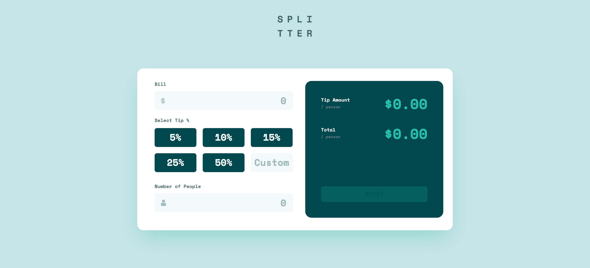

# Frontend Mentor - Tip calculator app solution

This is a solution to the [Tip calculator app challenge on Frontend Mentor](https://www.frontendmentor.io/challenges/tip-calculator-app-ugJNGbJUX). Frontend Mentor challenges help you improve your coding skills by building realistic projects.

## Table of contents

- [Overview](#overview)
  - [The challenge](#the-challenge)
  - [Screenshot](#screenshot)
  - [Links](#links)
  - [My process](#my-process)
  - [Built with](#built-with)
  - [What I learned](#what-i-learned)
- [Author](#author)
- [Acknowledgments](#acknowledgments)

## Overview

### The challenge

Users should be able to:

- View the optimal layout for the app depending on their device's screen size
- See hover states for all interactive elements on the page
- Calculate the correct tip and total cost of the bill per person

### Screenshot



### Links

- Solution URL: [https://github.com/akpekig/tip-calculator-app](https://github.com/akpekig/tip-calculator-app)
- Live Site URL: [https://akpekig.github.io/tip-calculator-app/](https://akpekig.github.io/tip-calculator-app/)

## My process

### Built with

- Semantic HTML5 markup
- CSS custom properties
- Flexbox
- CSS Grid
- Mobile-first workflow
- [React](https://reactjs.org/) - JS library
- [Gatsby](https://www.gatsbyjs.com/) - React framework
- [Tailwind CSS](https://tailwindcss.com/) - For styles

### What I learned

Preventing infinity values in JS.

```js
if (perPerson > Number.MAX_SAFE_INTEGER) {
  ...
}
```

## Author

- Website - [Web Developer Gillian Akpeki](https://wdga.xyz/)
- Frontend Mentor - [@akpekig](https://www.frontendmentor.io/profile/akpekig)

## Acknowledgments

Many thanks to [datarockets](https://datarockets.com/), whose job description prompted me to complete this challenge.
